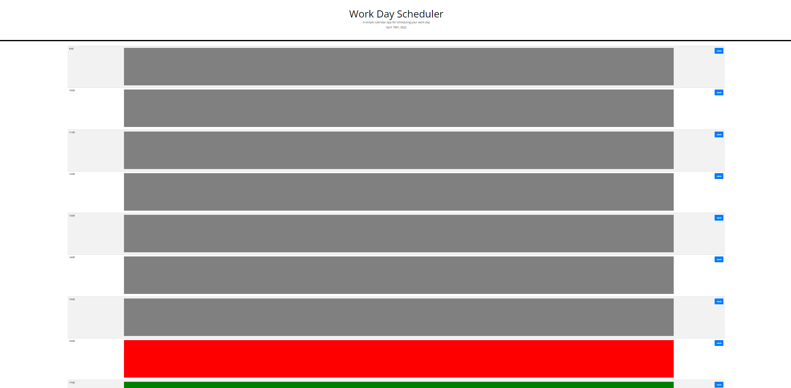

#WORK DAY SCHEDULER

## DESCRIPTION
The application provides a Work Day Scheduler template. It is a fron-end application that primarily utilises Javascript & Localstorage , allows user to save data to their local storage across browser sessions.

## USAGE
GIVEN I am using a daily planner to create a schedule
WHEN I open the planner
THEN the current day is displayed at the top of the calendar
WHEN I scroll down
THEN I am presented with timeblocks for standard business hours
WHEN I view the timeblocks for that day
THEN each timeblock is color coded to indicate whether it is in the past, present, or future
WHEN I click into a timeblock
THEN I can enter an event
WHEN I click the save button for that timeblock
THEN the text for that event is saved in local storage
WHEN I refresh the page
THEN the saved events persist
`

## CONTACT
further question please visit https://github.com/shingchan95, or contact shingchan1219@gmail.com
